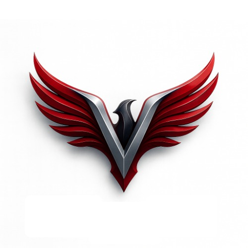

# 🎓 VWings24x7 - Student App

<div align="center">
  
</div>

<p align="center">
  <strong>A comprehensive, responsive web application designed for aviation students to manage their educational journey.</strong>
</p>

<p align="center">
  <a href="#-features">Features</a> •
  <a href="#%EF%B8%8F-technology-stack">Tech Stack</a> •
  <a href="#-getting-started">Getting Started</a> •
  <a href="#-docker-setup">Docker Setup</a> •
  <a href="#-project-structure">Project Structure</a>
</p>

---

*(Note: This is the web counterpart to the VWings24x7 Flutter mobile application)*

## 🚀 Features

- **User Authentication:** Secure login and registration system.
- **Classroom Management:** Interactive classrooms with chat functionality.
- **Course Enrollment:** Browse and enroll in aviation courses.
- **Fee Tracking:** Monitor and manage student fees.
- **Notifications:** Stay updated with important announcements.
- **Help Center:** Access support and FAQs.
- **Ads Integration:** Monetization through targeted advertisements.
- **Account Management:** Profile settings and personal information.
- **Responsive Design**: Fully optimized for desktop, tablet, and mobile viewing.
- **PWA Ready**: Includes manifest and service worker configuration for offline and installable web app experience.

## 🛠️ Technology Stack

- **Framework**: [React 19](https://react.dev/)
- **Build Tool**: [Vite 8](https://vitejs.dev/)
- **Routing**: [React Router v7](https://reactrouter.com/)
- **Animations**: [Framer Motion](https://www.framer.com/motion/)
- **HTTP Client**: [Axios](https://axios-http.com/)
- **Icons**: [Lucide React](https://lucide.dev/)
- **Styling**: Vanilla CSS with customized theming

## 💻 Getting Started

### Prerequisites

Ensure you have [Node.js](https://nodejs.org/) (v20+ recommended) installed on your machine.

### Installation

1. **Clone the repository** (if you haven't already):
   ```bash
   git clone <repository-url>
   cd VWings24x7-Student-App
   ```

2. **Install dependencies**:
   ```bash
   npm install
   ```

### Running the Application Locally

To start the local development server:

```bash
npm run dev
```

The application will typically be available at `http://localhost:5173`. The terminal output will provide the exact local URL.

### Building for Production

To create a production-ready build:

```bash
npm run build
```

The built assets will be generated in the `dist` directory.

To preview the production build locally:

```bash
npm run preview
```

## 🐳 Docker Setup

This project includes Docker support for easy deployment and isolation.

### Build and Run with Docker Compose (Recommended)

```bash
docker-compose up -d --build
```

The application preview server will be accessible at `http://localhost:8008`.

### Using Dockerfile Manually

1. **Build the image**:
   ```bash
   docker build -f Dockerfile.frontend -t vwings-student-app .
   ```

2. **Run the container**:
   ```bash
   docker run -p 8008:8008 vwings-student-app
   ```

## 📂 Project Structure

```text
VWings24x7-Student-App/
├── public/                 # Static assets and PWA manifest
├── src/                    # Source code
│   ├── components/         # Reusable React components
│   ├── screens/            # Application views/pages
│   ├── App.jsx             # Main application component
│   ├── main.jsx            # Entry point
│   ├── index.css           # Global styles
│   └── theme.js            # Theming configurations
├── index.html              # HTML template
├── package.json            # Project dependencies and scripts
├── vite.config.js          # Vite configuration
├── Dockerfile.frontend     # Docker configuration
└── docker-compose.yml      # Docker Compose configuration
```

## 📝 Scripts Reference

- `npm run dev`: Starts the Vite development server.
- `npm run build`: Compiles and bundles the app for production.
- `npm run lint`: Runs ESLint to check for code quality issues.
- `npm run preview`: Starts a local server to preview the built production app.
